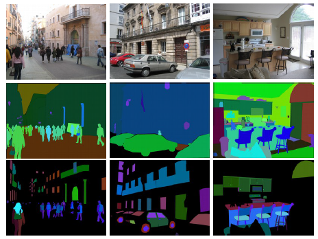

# Wall Segmentation [!\[DOI\](https://zenodo.org/badge/DOI/10.5281/zenodo.7944202.svg)]

Implementation of a wall segmentation algorithm in PyTorch.

Accompanying paper: [Getting Started with Wall Segmentation](https://www.researchgate.net/publication/363059238_Getting_Started_with_Wall_Segmentation).

Implementation is based on the paper: [Pyramid Scene Parsing Network](https://arxiv.org/abs/1612.01105).

The used database is [MIT ADE20K Scene parsing dataset](http://sceneparsing.csail.mit.edu/), where 150 different categories are labeled.
An example of an image from the database:  

Because, for solving the problem of wall segmentation, we do not need all the images inside the ADE20K database
(we need only indoor images), a subset of the database is used for training the segmentation module.

## Segmentation architecture  
 - Encoder - Obtains a feature map of the original image that has smaller height and width and a larger number of channels.
The architecture of the encoder, used in this project is the Dilated ResNet-50, where the last two blocks of the ResNet-50
architecture use dilated convolution with a smaller stride.
 - Decoder - Based on the feature map, classifies each pixel of the feature map into one of the classes. The architecture
of the decoder, used in this project is the PPM architecture.

## Structure of the project 
 - Folder [models](./models) consists of 3 separate .py files:
   - [resnet.py](models/resnet.py) - where the ResNet architecture is defined.
   - [models.py](models/models.py) - where the whole PPM architecture
   for the decoder is defined, the ResNet dilated architecture for the encoder, as well as the class for the segmentation
   module. Beside the classes for the different architectures, there are 2 helper functions for instantiating the encoder
   network as well as the decoder network.
   - [dataset.py](models/dataset.py) - Implementations of TrainDataset and ValDataset are taken from 
   [CSAILVision/semantic-segmentation-pytorch](https://github.com/CSAILVision/semantic-segmentation-pytorch)
   and small changes were made. The changes made to the original implementations of TrainDataset and ValDataset are for loading only
   images of interest (images that contain wall regions). Also, inside this folder, an additional function, for differentiating between the images of
   interest and other images, is implemented.
 - Folder [model_weights](model_weights/README.md) - where weights of the trained models are stored,
due to the size of the models, the models can be found on [link](https://drive.google.com/drive/folders/1xh-MBuALwvNNFnLe-eofZU_wn8y3ZxJg?usp=sharing).
 - Folder [data](./data) - Important files used for loading the dataset are here. (The Database is not present in the directory due to size)
 - Folder [cktp](./ckpt/README.md) - where checkpoints during training of the models are saved.
 - Folder [utils](./utils) - consists of:
   - [utils.py] - many helper functions used for training and testing wall segmentation models,
   - [constants.py] - all constants across the repository.
 - Folder [configs](./configs) - config used for training the models can be found here.
 - Folder [src](./src) - where code used for training ad evaluating is located. Consists of:
   - [train.py](./src/train.py) - code used for training a single epoch is located here;
   - [eval.py](./src/eval.py) - code for the validation step during training as well as a function for segmenting a single
   image, are located here.
 - [train_script.py](./train_script.py) - the code used for training the wall segmentation model.
 - [testing.ipynb](./testing.ipynb) - jupyter notebook which can be used for testing the wall segmentation
model on any RGB image.
 
## Repository contribution 

The main contribution of this project is simplifying the project already available at the
[link](https://github.com/CSAILVision/semantic-segmentation-pytorch) and training the segmentation module only for wall
segmentation. 
Three different approaches to training the model were considered. In all three approaches, the weights of
the encoder were initialized using the pretrained model of the ResNet-50 architecture trained on the ImageNet database.
- First considered approach was using transfer learning, to train the model on all 150 different categories, and then
changing the output layer of the decoder and training only the output layer on images of interest. 
- The second approach differs from the first approach only in the last part, where not only the last layer was trained
on images of interest, but, instead, the entire decoder is trained on images of interest. 
- The third approach did not include transfer learning as described in previous two cases. Instead, the segmentation 
module was trained from start on the images of interest.

Beside the three described approaches, another 2 models were trained using different backbones, dilated ResNet-18 and 
dilated ResNet-50. Both of these models were trained end2end on images of interest, without transfer learning. 

### Results of different approaches 

Mean values of pixel accuracy and IoU on validation subset (only on images of interest) are given in the table.

|                  |  First approach  | Second approach  | Third approach |
|:----------------:|:----------------:|:----------------:|:--------------:|
|Pixel accuracy [%]|      84.82       |      86.24       |     90.75      |
|IoU [%]           |      56.87       |      59.08       |     69.05      |

First approach:   
    
Second approach:  
   
Third approach:  
   
[From left to right: Test image, Segmentation mask, Predicted result]

### Results with different backbones

The three different backbones yielded different results on the validation set. The worst model was the
model with the ResNet-18 backbone (Acc: 89.99% | IoU: 67.38%). This was expected as this backbone is the simplest of 
the 3 compared models. Better results are obtained using the ResNet-50 backbone (Acc: 90.75% | IoU 69.05), while the 
best results are obtained using the ResNet-101 backbone (Acc: 92.13% | IoU: 72.58%).

## Quick start

In this section, the following will be explained:
- training of the wall segmentation model
- testing of the wall segmentation model on arbitrary images

### Training

For training the wall segmentation model, script `train_script.py` is used. To run the training, [config](./configs/config.json)
has to be changed. Inside the config the following parameters have to be set:
- `ROOT_DATASET` - absolute path the to directory where the downloaded ADE20K dataset is located (without
`ADEChallengeData2016` at the end of the path),
- `CONTINUE_TRAINING` - if `True`, continue interrupted training,
- `CHECKPOINT_DIR_PATH` - name of the directory inside ckpt inside which the model and tensorboard will be saved,
- `ENCODER_MODEL` - model used for the encoder, can be one of the following: `resnet18`, `resnet18-dilated`,
`resnet50`, `resnet50-dilated`, `resnet101`, `resnet101-dilated`*
- `MODEL_ENCODER_WEIGHTS_PATH` - if present, represents the pretrained encoder model (optional parameter),
- `MODEL_DECODER_WEIGHTS_PATH` - if present, represents the pretrained decoder model (optional parameter).

Also, if not using pretrained encoder and decoder, resnet pretrained model has to be downloaded into the [model_weights](./model_weights)
directory (path to the pretrained model and all the needed details can be found [here](./model_weights/README.md))

For changing other training hyperparameters, see inside the [constants.py](./utils/constants.py) script.

*note: when training different models, following hyperparameters may need to be changed in the 
[constants.py](./utils/constants.py) script:
 - `PADDING` and `SEGM_DOWNSAMPLING_RATE` - when training with dilated backbones, these parameter have to be 8, and 
when using non-dilated backbones these have to be 32;
 - `FC_DIM` - when training with ResNEt-18 backbones, this parameter has to be 512, while for ResNet-50 and ResNet-101,
this parameter has to be 2048.

### Testing

Wall segmentation models can be tested on arbitrary images using [testing.ipynb](./testing.ipynb) jupyter notebook.
Details how to run this notebook can be found inside the notebook itself.